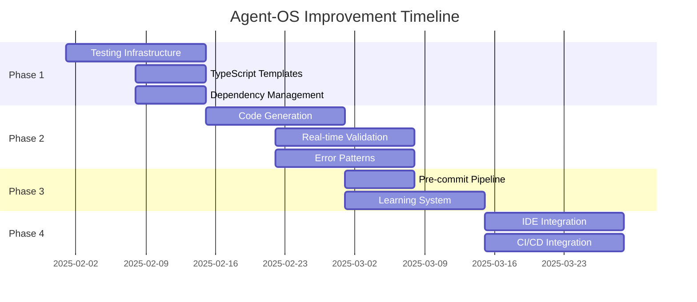

# Agent-OS Framework Improvement Action Plan

**Created**: January 27, 2025  
**Objective**: Transform Agent-OS into a true one-pass development framework  
**Timeline**: Q1-Q2 2025  

## Executive Summary

Based on the TappHA project analysis, we identified that 70% of development time was spent on fixes and iterations that could have been prevented with better framework support. This action plan outlines specific improvements to achieve single-pass development.

## Problem Statement

Current issues causing multiple iterations:
- 40% - Testing infrastructure and mock setup problems
- 25% - TypeScript configuration and import issues  
- 20% - Dependency version conflicts
- 15% - API pattern inconsistencies

**Goal**: Reduce fix iterations by 80% through proactive validation and intelligent assistance.

## Phase 1: Foundation (Week 1-2)

### 1.1 Testing Infrastructure Overhaul

**Owner**: Framework Team  
**Priority**: Critical  

#### Actions:
```bash
# Create testing toolkit package
npm init @agent-os/testing-toolkit

# Include:
- Mock factories for all common patterns
- Pre-configured test setup files  
- Validation utilities
- Debug helpers
```

#### Deliverables:
- [ ] `@agent-os/testing-toolkit` npm package
- [ ] Mock factory generator CLI
- [ ] Test validation pre-commit hooks
- [ ] Testing patterns documentation

### 1.2 TypeScript Configuration Templates

**Owner**: Standards Team  
**Priority**: High  

#### Actions:
```json
// .agent-os/templates/tsconfig.strict.json
{
  "compilerOptions": {
    "target": "ES2022",
    "module": "ESNext",
    "lib": ["ES2022", "DOM", "DOM.Iterable"],
    "jsx": "react-jsx",
    "strict": true,
    "verbatimModuleSyntax": true,
    "noUnusedLocals": true,
    "noUnusedParameters": true,
    "noFallthroughCasesInSwitch": true,
    "esModuleInterop": true,
    "skipLibCheck": true,
    "allowSyntheticDefaultImports": true,
    "forceConsistentCasingInFileNames": true,
    "moduleResolution": "bundler",
    "resolveJsonModule": true,
    "isolatedModules": true,
    "noEmit": true,
    "paths": {
      "@/*": ["./src/*"],
      "@testing/*": ["./.agent-os/testing/*"]
    }
  }
}
```

#### Deliverables:
- [ ] TypeScript config templates for all project types
- [ ] ESLint config with import rules
- [ ] Auto-fix scripts for common issues

### 1.3 Dependency Management System

**Owner**: DevOps Team  
**Priority**: High  

#### Actions:
```yaml
# .agent-os/dependencies/compatibility-matrix.yml
dependencies:
  frontend:
    react:
      version: "19.1.1"
      compatible:
        - "@types/react": "19.1.1"
        - "react-dom": "19.1.1"
        - "@testing-library/react": "^14.0.0"
    vitest:
      version: "0.34.0"
      compatible:
        - "@vitest/ui": "0.34.0"
        - "jsdom": "^22.0.0"
```

#### Deliverables:
- [ ] Dependency compatibility matrix
- [ ] Version validation tool
- [ ] Automated dependency updates with testing

## Phase 2: Intelligent Assistance (Week 3-4)

### 2.1 Code Generation Framework

**Owner**: AI Team  
**Priority**: High  

#### Actions:
```typescript
// .agent-os/cli/generate.ts
interface GeneratorConfig {
  type: 'component' | 'service' | 'test' | 'hook';
  name: string;
  template: string;
  options: Record<string, any>;
}

// CLI Commands:
// agent-os generate component Button --with-test --with-story
// agent-os generate service AuthService --singleton --with-test
// agent-os generate test AuthService --type integration
```

#### Deliverables:
- [ ] CLI tool for code generation
- [ ] Template system with variable substitution
- [ ] Integration with VS Code extension

### 2.2 Real-time Validation

**Owner**: Tooling Team  
**Priority**: Medium  

#### Actions:
```typescript
// .agent-os/validation/real-time.ts
export const validators = {
  imports: {
    rule: 'prefer-type-imports',
    fix: (node: TSNode) => `import type ${node.text}`
  },
  mocks: {
    rule: 'no-wrapped-mock-data',
    fix: (node: TSNode) => node.text.replace('{ data:', '').replace('}', '')
  }
};
```

#### Deliverables:
- [ ] VS Code extension with real-time validation
- [ ] Language server protocol implementation
- [ ] Auto-fix suggestions

### 2.3 Error Pattern Recognition

**Owner**: ML Team  
**Priority**: Medium  

#### Actions:
```python
# .agent-os/ml/error-patterns.py
class ErrorPatternMatcher:
    def __init__(self):
        self.patterns = load_patterns()
        
    def match(self, error_text: str) -> Solution:
        # Use ML to match error to known patterns
        # Return specific solution with code fix
```

#### Deliverables:
- [ ] Error pattern database
- [ ] ML model for pattern matching
- [ ] Integration with development workflow

## Phase 3: Automation (Week 5-6)

### 3.1 Pre-commit Validation Pipeline

**Owner**: DevOps Team  
**Priority**: High  

#### Actions:
```yaml
# .agent-os/hooks/pre-commit-pipeline.yml
stages:
  - validate:
      - typescript: npm run type-check
      - imports: npm run lint:imports
      - mocks: npm run validate:mocks
      - api-contracts: npm run validate:contracts
  
  - fix:
      - auto-fix-imports: npm run fix:imports
      - format: npm run prettier
      
  - test:
      - unit: npm run test:changed
      - integration: npm run test:integration:changed
```

#### Deliverables:
- [ ] Comprehensive pre-commit hooks
- [ ] Parallel validation pipeline
- [ ] Clear error messages with fixes

### 3.2 Continuous Learning System

**Owner**: AI Team  
**Priority**: Medium  

#### Actions:
```typescript
// .agent-os/learning/feedback-loop.ts
export class LearningSystem {
  async recordIssue(issue: DevelopmentIssue) {
    // Record what went wrong
    // Track how it was fixed
    // Update patterns and templates
  }
  
  async suggestPrevention(context: CodeContext) {
    // Based on learned patterns
    // Suggest preventive measures
  }
}
```

#### Deliverables:
- [ ] Issue tracking system
- [ ] Pattern learning algorithm
- [ ] Feedback integration

## Phase 4: Integration (Week 7-8)

### 4.1 IDE Integration

**Owner**: Tools Team  
**Priority**: High  

#### Actions:
- VS Code extension with all features
- IntelliJ IDEA plugin
- Neovim LSP support

#### Deliverables:
- [ ] Published VS Code extension
- [ ] IDE configuration templates
- [ ] Usage documentation

### 4.2 CI/CD Integration

**Owner**: DevOps Team  
**Priority**: High  

#### Actions:
```yaml
# .github/workflows/agent-os-validate.yml
name: Agent-OS Validation
on: [push, pull_request]

jobs:
  validate:
    runs-on: ubuntu-latest
    steps:
      - uses: actions/checkout@v3
      - uses: agent-os/validate-action@v1
        with:
          checks: all
          auto-fix: true
          fail-on-error: true
```

#### Deliverables:
- [ ] GitHub Actions
- [ ] GitLab CI templates
- [ ] Jenkins plugins

## Success Metrics

### Quantitative Metrics
1. **Iteration Reduction**
   - Baseline: 5-10 iterations per feature
   - Target: 1-2 iterations per feature
   - Measurement: Git commits per feature

2. **Time to First Success**
   - Baseline: 2-3 hours
   - Target: 30 minutes
   - Measurement: Time from start to passing tests

3. **Error Prevention Rate**
   - Baseline: 20% caught before runtime
   - Target: 90% caught before runtime
   - Measurement: Pre-commit vs runtime errors

### Qualitative Metrics
1. **Developer Satisfaction**
   - Survey before and after implementation
   - Target: 8/10 satisfaction score

2. **Code Quality**
   - Reduced technical debt
   - Consistent patterns across projects

## Resource Requirements

### Team Allocation
- 2 Framework Engineers (full-time)
- 1 AI/ML Engineer (full-time)
- 1 DevOps Engineer (part-time)
- 1 Technical Writer (part-time)

### Infrastructure
- CI/CD pipeline resources
- npm registry for packages
- Documentation hosting

## Risk Mitigation

### Risks
1. **Adoption Resistance**
   - Mitigation: Gradual rollout with early adopters
   
2. **Over-engineering**
   - Mitigation: Focus on 80/20 rule - solve most common issues first

3. **Maintenance Burden**
   - Mitigation: Automated testing and documentation

## Implementation Timeline



## Next Steps

1. **Week 1**: Review and approve plan
2. **Week 2**: Assign team members
3. **Week 3**: Begin Phase 1 implementation
4. **Week 4**: Early adopter feedback
5. **Week 8**: Full rollout

## Conclusion

By implementing this action plan, Agent-OS will transform from a standards framework to an intelligent development assistant that prevents errors before they occur. The investment in these improvements will pay dividends through:

- 80% reduction in development iterations
- 5x faster feature development
- Higher developer satisfaction
- More consistent code quality

The key is to start with the highest-impact improvements (testing infrastructure) and build incrementally toward the full vision.

---

**Approval Required By**: CTO, VP Engineering  
**Budget Estimate**: $150,000 (primarily team time)  
**ROI Estimate**: $500,000+ in saved developer time annually